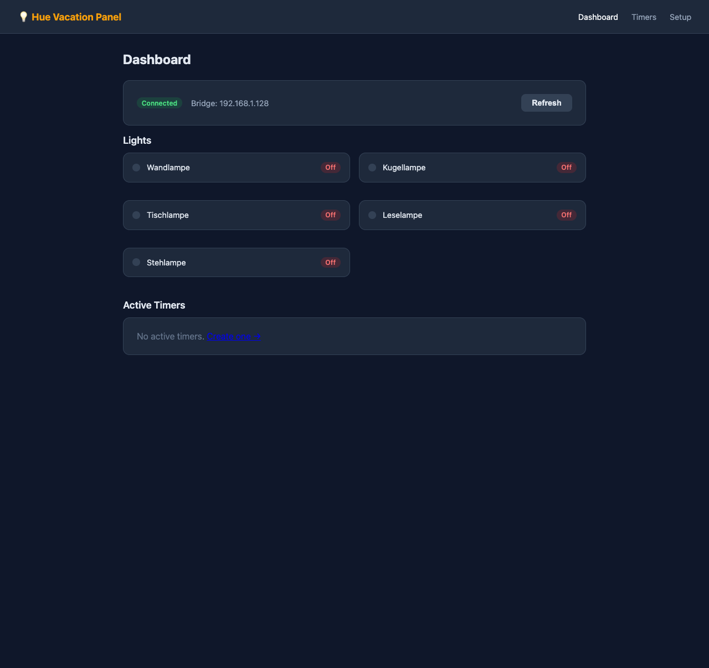
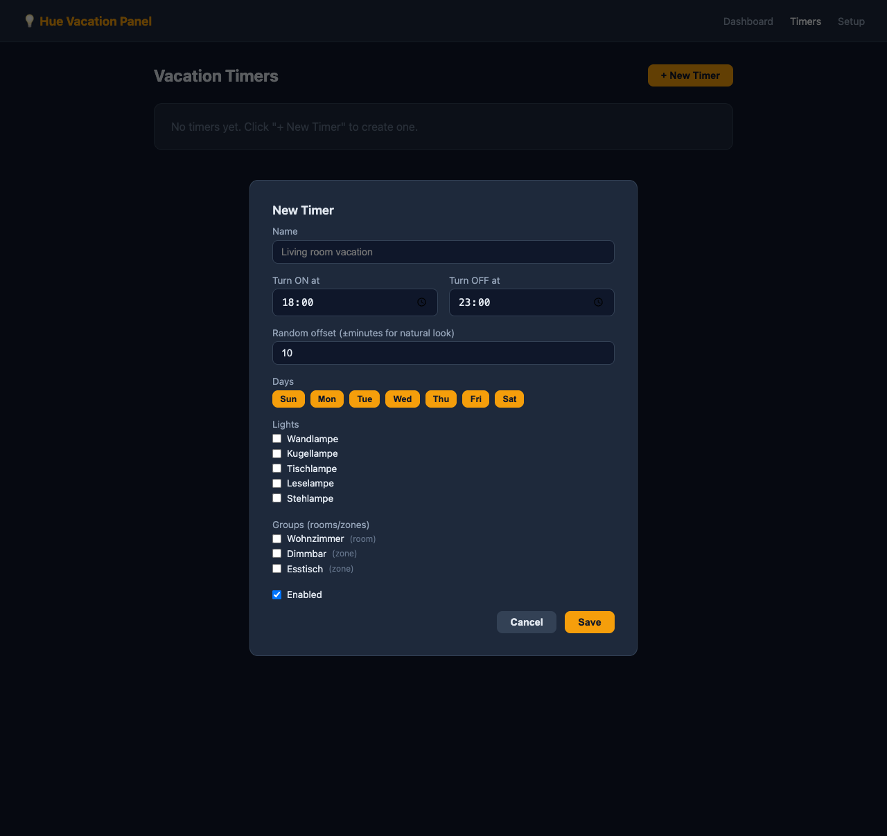

# 💡 Hue Vacation Panel

A lightweight self-hosted web app to schedule **vacation lighting timers** for your Philips Hue setup. Randomise on/off times to make it look like someone's home.

## Features

- **Auto-discover** your Hue bridge (Philips cloud, mDNS, local probe)
- **One-click pairing** — press the bridge link button, enter IP, done
- **Vacation timers** — per-timer on/off times, day-of-week selection
- **Random offset** — ±N minutes to make lighting look natural
- **Target lights or whole rooms/zones**
- **Runs locally** — no Philips cloud account needed after pairing
- **Tiny footprint** — single Node process, ~2 MB, SQLite-free (JSON storage)

## Screenshots

| Dashboard | Timers | Timer Modal | Setup |
|-----------|--------|-------------|-------|
|  |  |  |  |

---

## Installation

### Option A — LXC / bare-metal (recommended for Proxmox)

No Docker, no Node, no npm required on the target machine.

```sh
curl -fsSL https://github.com/githendrik/hue-panel/releases/latest/download/install.sh | sh
```

This will:
1. Install the [Bun](https://bun.sh) runtime if not already present
2. Download and extract the latest release to `/opt/hue-panel/`
3. Install and start a **systemd service** (`hue-panel`)

Then open **http://\<your-lxc-ip\>:3000**

```sh
# Manage the service
systemctl status hue-panel
systemctl restart hue-panel
journalctl -u hue-panel -f
```

> **Data** (bridge config + timers) is stored in `/opt/hue-panel/data/` and survives updates.

---

### Option B — Docker / Docker Compose

```sh
git clone https://github.com/githendrik/hue-panel.git
cd hue-panel
docker compose up -d --build
```

Open **http://localhost:3000**

---

## Getting started

1. Open **http://\<host\>:3000/setup**
2. Click **Scan Network** — your bridge should appear automatically
3. Press the **physical link button** on your Hue bridge
4. Click **Pair Bridge** within 30 seconds
5. Go to **Timers** → **+ New Timer** and configure your schedule

---

## Proxmox LXC recommended settings

| Setting      | Value                        |
|--------------|------------------------------|
| Template     | Debian 12 (bookworm)         |
| CPU          | 1 core                       |
| RAM          | 256 MB                       |
| Disk         | 4 GB                         |
| Network      | Static IP on your LAN        |
| Unprivileged | Yes                          |

Assign a **static IP** so the panel URL stays stable and the bridge always resolves it.

---

## Configuration

All configuration is via environment variables:

| Variable           | Default   | Description                        |
|--------------------|-----------|------------------------------------|
| `PORT`             | `3000`    | HTTP port to listen on             |
| `HOST`             | `0.0.0.0` | Interface to bind                  |
| `HUE_STORAGE_PATH` | `./data`  | Directory for bridge config + timers |

For the systemd install, edit `/etc/systemd/system/hue-panel.service` then `systemctl daemon-reload && systemctl restart hue-panel`.

---

## How it works

```
Browser  ──►  Nuxt (SPA)  ──►  Nitro API routes  ──►  Hue Bridge (HTTPS local)
                                      │
                               Nitro scheduler
                            (hue:tick every minute)
                                      │
                              JSON file storage
                           (/opt/hue-panel/data/)
```

- **Hue API v2** — direct local HTTPS calls, no cloud dependency after pairing
- **Self-signed cert** handled transparently via `node:https.Agent`
- **Scheduler** — Nitro's built-in experimental tasks run `hue:tick` every minute
- **Random offset** — baked into stored on/off times at save time, no runtime drift

---

## Releases

Releases are built automatically by GitHub Actions on every `v*` tag and published to [GitHub Releases](https://github.com/githendrik/hue-panel/releases).

Each release ships:
- `hue-panel-linux-x64.tar.gz` — pre-built `.output/` ready to run
- `hue-panel-linux-x64.tar.gz.sha256` — checksum
- `install.sh` — one-liner installer for Debian/Ubuntu

To cut a new release:

```sh
git tag v1.2.3
git push origin v1.2.3
```

---

## Development

```sh
git clone https://github.com/githendrik/hue-panel.git
cd hue-panel
npm install
npm run dev
```

Open **http://localhost:3000**

---

## License

MIT
